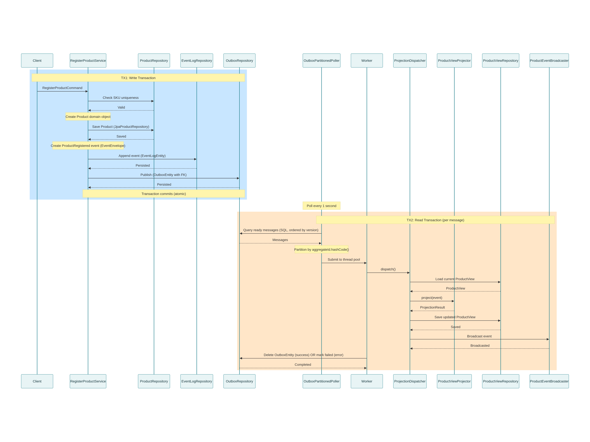

# Exercice 4 : CQRS et Event Sourcing

## Tâche 1 : Questions sur la base de code 

### Expliquer le rôle de l'interface Projector dans le système de gestion des événements.

L'interface Projector transforme les événements en données lisibles. Quand un événement arrive (ex: produit créé), elle met à jour une table de lecture ProductView.

### Expliquer le rôle du type S dans l'interface Projector.
S représente le type de table de lecture (ProductView, OrderView, StatsView, etc.).

### Avantages de cette approche
- Interface vs classe : Permet de changer l'implémentation (PostgreSQL, MongoDB, mémoire) sans modifier le reste du code
- ProjectionResult : Conteneur explicite (succès, ignoré, échec) sans exceptions
- Monade vs exceptions*: Pipeline fluide, type-safe, lisibilité améliorée

## Tâche 2 : Outbox Pattern

### Méthodes de OutboxRepository
- `publish()` : Ajouter un événement
- `fetchReady()` : Récupérer les événements prêts
- `delete()` / `markFailed()` : Gérer le cycle de vie

### Garantie de livraison
Une seule transaction sauvegarde les données métier ET l'événement. Même si le service plante après, le polleur relira l'événement.

### Flux concret

Diagramme de séquence
 

### Gestion des erreurs
- `attempts` : Nombre d'essais
- `next_attempt_at` : Prochaine tentative
- `last_error` : Raison de l'échec
- Stratégie : Délai exponentiel (30s) jusqu'à max retries, puis blocage 30min

## Tâche 3 : Journal d'événements

### Expliquer le rôle du journal d'événements dans le système de gestion des événements.
Archive tous les événements de façon immuable. C'est l'historique complet du système.

### Pourquoi l'interface EventLogRepository ne comporte-t-elle qu'une seule méthode append ? Pourquoi n'y a-t-il pas de méthode pour récupérer les événements ou les supprimer ?

- Immuabilité: Pas de modification de l'historique (audit légal)
- Replay : Recréer l'état complet d'une entité
- Source de vérité : Les événements = backup ultime

### En tirant vos conclusions de votre réponse à la question 2 et de l'analyse de l'application (Objets liés à l'event log, schéma de base de données), déterminez les implications de cette conception sur la gestion des événements dans l'application et quelles pourraient être les autres usages du journal d'événements.

- Debug et audit trail
- Replay pour nouveaux services
- Migration de format
- Reconstitution d'état à une date donnée

## Tâche 4 : Limites de CQRS

### Identifier et expliquer les principales limites de l'architecture CQRS dans le contexte de l'application.
| Limite | Description |
|--------|-------------|
| Complexité | 2 bases (write + read) à synchroniser |
| Lag | Le read model peut être décalé |
| Stockage ×2 | Événements + tables de lecture |
| Overhead | Polleur tournant H24 |

### Quelles limites intrinsèques à CQRS sont déjà compensées par la mise en œuvre actuelle de l'application ?
- Dual write : Outbox garantit transaction unique
- Ordre garanti : Polling par `aggregate_version`
- Idempotence : Projecteur ignore événements anciens

### Quelles autres limites pourraient être introduites par cette mise en œuvre ?
- Polleur unique = point de défaillance unique
- Événements infinis → DB pleine (pas de purge)
- Couplage fort : 1 événement → 1 projecteur uniquement

### Que se passerait-il dans le cas d'une projection multiple (un évènement donnant lieu à plusieurs actions conjointes mais de nature différente) ?
Problème actuel : Un seul ProjectionResult par événement

### Question bonus 

Solutions
- Multi-projecteurs : Dispatcher route par type
- Kafka : Projections parallèles asynchrones
- Snapshots : Purger anciens événements périodiquement
- Event bus : Projecteurs s'abonnent sélectivement