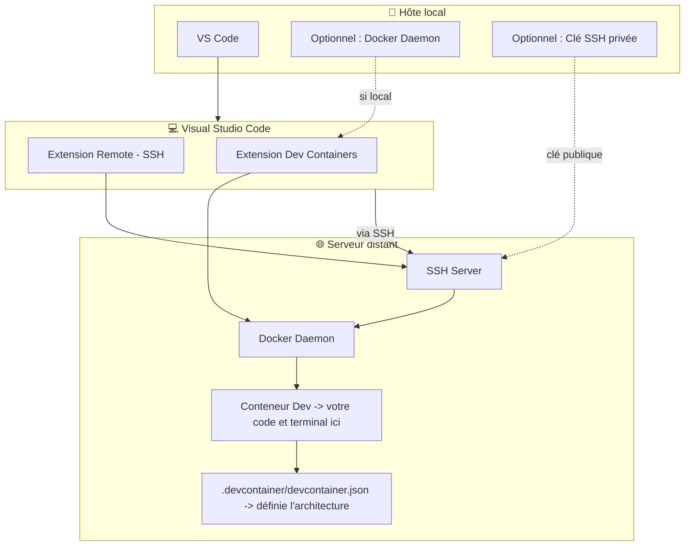
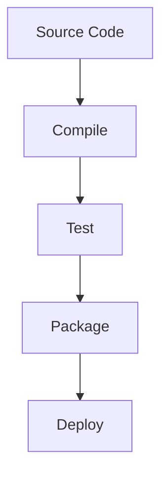

# TD1 : Prise en main

L'objectif de ce TD est de prendre en main les différents outils à votre disposition et dont vous aurez besoin pour travailler sur le projet de travaux pratiques.

## Outils à découvrir

- Docker et devcontainers : des outils pour créer des environnements de développement isolés et reproductibles.
- Gradle : un outil de build moderne pour Java et d'autres langages, facilitant la gestion des dépendances et l'automatisation des tâches.
- Performant Node Package Manager (pnpm) : un gestionnaire de paquets rapide et efficace pour les projets JavaScript/TypeScript sous NodeJS

## Exercice 1 : Devcontainers sous Docker

Dans cet exercice, vous allez découvrir comment utiliser les devcontainers sous Docker pour créer un environnement de développement isolé et reproductible.

Pour ce faire, vous devriez utiliser un IDE compatible avec les devcontainers, tel que Visual Studio Code, IntelliJ IDEA ou tout autre IDE prenant en charge cette fonctionnalité.

### Objectifs de l'exercice

- Comprendre comment utiliser les devcontainers pour créer un environnement de développement isolé.
- Explorer les outils et les configurations disponibles dans le devcontainer.
- Créer un devcontainer basé sur java et gradle puis initier un projet.
- Comprendre comment les devcontainers peuvent faciliter le développement.
- Prendre en main les conteneurs de services.
- Ajouter des conteneurs de service.
- Utiliser le port forwarding pour accéder aux services.
- Déclarer des extensions d'IDE.

### Étapes à suivre (VSCode)

1. Ouvrir une fenêtre dans Visual Studio Code.
2. Deux possibilités :
    - Vous avez un démon docker à disposition.
        - Installer l'extension "Dev Containers"
    - Vous n'avez pas de démon docker local.
        - Installer l'extension "Remote - SSH"
        - Se connecter au serveur distant :
            1. Ouvrir la palette de commandes (Ctrl+Shift+P) et sélectionner "Remote-SSH: Connect to Host...".
            2. Entrer l'adresse de votre serveur.
            3. Entrer votre nom d'utilisateur et mot de passe si nécessaire.
            5. Optionel: Créer une clé SSH sur votre hôte local et ajouter la partie publique au fichier `~/.ssh/authorized_keys` de votre serveur distant.
        - Installer l'extension "Dev Containers"
3. Utilisez le terminal ou l'explorateur de fichiers pour créer un nouveau répertoire de projet.
4. Ouvrir votre dossier de projet
5. Créer un fichier `.devcontainer/devcontainer.json` avec le contenu suivant :
```json
{
    "name": "Java Gradle Devcontainer",
    "image": "debian:trixie-slim",
    "workspaceFolder": "/workspace",
    "workspaceMount": "source=${localWorkspaceFolder},target=/workspace,type=bind,consistency=cached"
}
```
6. Ouvrir le dossier du projet dans un conteneur en utilisant la commande "Dev Containers: Reopen Folder in Container".
7. Explorer l'environnement de développement disponible.

### Résultats attendus

À la fin de cette partie, vous devriez être en mesure de travailler dans un environnement de développement isolé ne comportant encore aucun outil spécifique.

Diagramme :


### Ajouter des éléments de développement

1. Ouvrir le fichier `.devcontainer/devcontainer.json`.
2. Remplacer la section `image` par `build` :
```json
{
    "name": "Java Gradle Devcontainer",
    "image": "debian:trixie-slim", // [!code --]
    "build": { // [!code ++]
        "dockerfile": "Dockerfile", // [!code ++]
        "context": "." // [!code ++]
    }, // [!code ++]
    "workspaceFolder": "/workspace",
    "workspaceMount": "source=${localWorkspaceFolder},target=/workspace,type=bind,consistency=cached"
}
```
3. Ajouter un fichier `.devcontainer/Dockerfile` :
```dockerfile
FROM debian:trixie-slim
```
4. Depuis un terminal accédant au docker, lancer le nouveau conteneur dans l'état actuel, nous allons ensuite valider les étapes et les reporter dans le Dockerfile une à une :
```bash
docker run -it --rm debian:trixie-slim /bin/bash
```
4. Installer SDKMAN pour gérer les paquets liés à l'écosystème Java :
```bash
curl -s "https://get.sdkman.io" | bash
```

:::warning
Si `curl` n'est pas trouvé, exécutez :
```bash
apt update
apt install -y curl
```

Même chose pour les autres éventuels paquets (zip, unzip, etc)

Pensez à les ajouter dans une étape RUN initiale du Dockerfile pour lorsque vous reconstruirez l'image.
:::

5. Lister les versions disponibles de Java :
```bash
source "$HOME/.sdkman/bin/sdkman-init.sh"
sdk list java
```
6. Installer une version de Java récente, choisir n'importe quelle "flavor" mais vous pouvez préférer Temurin pour la généricité (-tem) :
```bash
sdk install java <version>
```
7. Vérifier l'installation de Java :
```bash
java -version
```
8. Reporter les étapes dans le Dockerfile (variabiliser les versions des logiciels) :
```dockerfile
FROM debian:trixie-slim

# [!code ++]
ENV SDKMAN_JDK_VERSION=<version>

# [!code ++]
# Installer des dépendances basiques
# [!code ++]
RUN apt update && apt install -y git curl wget unzip zip

# [!code ++]
RUN curl -s "https://get.sdkman.io" | bash

# [!code ++]
RUN bash -c "source $HOME/.sdkman/bin/sdkman-init.sh && sdk install java $SDKMAN_JDK_VERSION"
```
9. Installer Gradle :
```bash
sdk list gradle
```
```bash
sdk install gradle <version>
```
:::tip
Il est possible d'installer la version "latest" en utilisant la commande suivante :
```bash
sdk install gradle
```

Cependant, il est recommandé de spécifier une version précise pour garantir la cohérence de l'environnement de développement.
:::
10. Vérifier l'installation de Gradle :
```bash
gradle -v
```
11. Reporter les étapes dans le Dockerfile (variabiliser les versions des logiciels) :
```dockerfile
FROM debian:trixie-slim

ENV SDKMAN_JDK_VERSION=<version>
# [!code ++]
ENV SDKMAN_GRADLE_VERSION=<version>

# ...

# [!code ++]
RUN bash -c "source $HOME/.sdkman/bin/sdkman-init.sh && sdk install gradle $SDKMAN_GRADLE_VERSION"
```
12. Reconstruire le conteneur via VSCode pour appliquer les modifications :
    - Ouvrir la palette de commandes (Ctrl+Shift+P) et sélectionner "Remote-Containers: Rebuild Container"

### Tester l'environnement en initialisant un projet Gradle

1. Ouvrir un terminal dans VSCode.
2. Exécuter la commande suivante pour créer un nouveau projet Gradle :
```bash
gradle init
```
3. Suivre les instructions à l'écran pour configurer le projet.
<details>
<summary>Instructions détaillées</summary>

1. Choisir le type de projet "1. Application".
2. Choisir le langage d'implémentation "1. Java".
3. Choisir la version de Java "21".
4. Choisir le nom du projet "test".
5. Choisir la structure du projet "1. Single application project".
6. Choisir le DSL du script de build "2. Groovy".
7. Choisir le framework de test "4. JUnit Jupiter".
8. Accepter les valeurs par défaut pour les autres options.

```
Starting a Gradle Daemon, 3 busy and 3 incompatible and 3 stopped Daemons could not be reused, use --status for details

Select type of build to generate:
  1: Application
  2: Library
  3: Gradle plugin
  4: Basic (build structure only)
Enter selection (default: Application) [1..4] 

Select implementation language:
  1: Java
  2: Kotlin
  3: Groovy
  4: Scala
  5: C++
  6: Swift
Enter selection (default: Java) [1..6] 

Enter target Java version (min: 7, default: 21): 

Project name (default: _test): test

Select application structure:
  1: Single application project
  2: Application and library project
Enter selection (default: Single application project) [1..2] 

Select build script DSL:
  1: Kotlin
  2: Groovy
Enter selection (default: Kotlin) [1..2] 2

Select test framework:
  1: JUnit 4
  2: TestNG
  3: Spock
  4: JUnit Jupiter
Enter selection (default: JUnit Jupiter) [1..4] 

Generate build using new APIs and behavior (some features may change in the next minor release)? (default: no) [yes, no] 


> Task :init
Learn more about Gradle by exploring our Samples at https://docs.gradle.org/8.14.3/samples/sample_building_java_applications.html

BUILD SUCCESSFUL in 40s
1 actionable task: 1 executed
```
</details>

5. Vérifier que le projet fonctionne en exécutant :
```bash
gradle build
```
6. ... puis lancer l'application :
```bash
gradle run
```
7. Vous devriez voir la sortie suivante :
```
Hello, World!
```

## Exercice 2 : Questions; Comprendre comment les devcontainers peuvent faciliter le développement.

1. Qu'est-ce qu'un devcontainer et comment est-il utilisé dans un projet ?
2. Quels sont les avantages d'utiliser un devcontainer pour le développement avec de la gestion de dépendances ?
3. Comment les dépendances et les outils sont-ils gérés dans un devcontainer ?
4. Le dossier `.devcontainer` doit-il être versionné avec le code source du projet ? Expliquer pourquoi ou pourquoi pas.

## Exercice 3 : Ajouter des conteneurs de services

Dans le cadre des développements, il peut être nécessaire d'ajouter des conteneurs de services pour simuler des environnements de production ou pour tester des interactions entre différents services. Cela peut inclure des bases de données, des systèmes de messagerie, ou d'autres services externes.

1. Convertir le devcontainer de build à docker-compose :
```json
{
    "name": "Java Gradle Devcontainer",
    "build": { // [!code --]
        "context": ".", // [!code --]
        "dockerfile": "Dockerfile" // [!code --]
    }, // [!code --]
    "dockerComposeFile": "docker-compose.yml", // [!code ++]
    "service": "devcontainer", // [!code ++]
    "workspaceFolder": "/workspace",
    // On a remplacé le workspaceMount par un simple bind mount dans le docker-compose
    "workspaceMount": "source=${localWorkspaceFolder},target=/workspace,type=bind,consistency=cached" // [!code --]
}
```
:::tip
Remarquez que nous avons ajouté une propriété `service`. Dans le cas d'un projet utilisant Docker Compose, cela permet de spécifier le service principal à utiliser pour le développement parmi les différents services définis dans le fichier `docker-compose.yml`.
:::

2. Ajouter les définitions de conteneurs pour les services dans le fichier `docker-compose.yml`. Pour l'exemple, nous allons ajouter un conteneur de base de données PostgreSQL.
```yaml
services:
  devcontainer:
    build:
      context: .
      dockerfile: Dockerfile
    volumes:
      - ..:/workspace
  db:
    image: postgres:latest
    environment:
      POSTGRES_USER: user
      POSTGRES_PASSWORD: password
      POSTGRES_DB: test
```
:::warning
Dans cet exemple, si on essayait de lancer la stack telle quelle, on obtiendrait une erreur car le conteneur `devcontainer` s'arrêterait immédiatement après son démarrage.

Pour éviter cela, nous devons nous assurer que le conteneur `devcontainer` reste en cours d'exécution

```yaml
services:
  devcontainer:
    # ...
    command: sleep infinity # [!code ++]
# ...
```
:::

:::tip
Comparé à une stack compose classique, remarquez qu'on ne déclare pas de ports exposés. C'est parce-qu'en devcontainer, nous utiliserons les fonctions de port forwarding intégrées à notre IDE.
:::

3. On peut maintenant démarrer les services avec notre IDE :
    - Sous VSCode, ouvrir la palette de commandes (Ctrl+Shift+P) et sélectionner "Remote-Containers: Rebuild Container".

Le conteneur sera reconstruit avec les nouvelles configurations et dépendances.

4. Une fois le conteneur en cours d'exécution, vous pouvez y accéder via le terminal intégré de votre IDE.
5. Ajoutons maintenant le port forwarding pour le conteneur de base de données. Dans le fichier `devcontainer.json`, ajoutez la configuration suivante :
```json
"forwardPorts": [
    "db:5432"
]
```

:::tip
Rappel : Docker utilise un système de résolution de noms basé sur les services définis dans le fichier `docker-compose.yml`. Cela signifie que vous pouvez utiliser le nom du service (dans ce cas, `db`) pour faire référence au conteneur de base de données. Les fonctions réseaux utiliserons un micro-DNS interne pour résoudre ce nom avec son IP Virtuelle.

Dans le cas du forwardPorts, on spécifie ici le nom du service suivi du port à exposer. Cela permet de forward un port même vers un service annexe. Ainsi, spécifier uniquement un port sans le nom du service ne forwardera que le port local (service devcontainer principal).

Vous pouvez jouer avec ces fonctionnalités pour établir une configuration réseau complexe entre vos services, votre IDE et votre hôte.
:::

## Exercice 4 : Déclarer des extensions d'IDE

Dans cet exercice, nous allons déclarer des extensions d'IDE à utiliser dans notre devcontainer. Cela permettra d'améliorer notre environnement de développement en ajoutant des fonctionnalités spécifiques à notre projet.

1. Ici, avec VSCode, nous allons simplement ajouter les extensions qui nous intéressent (ex: `vscjava.vscode-java-pack`)
2. Après l'installation, vous pouvez faire un clic droit sur l'extension et sélectionner "Ajouter au devcontainer.json".
3. Votre fichier comportera ainsi une section complémentaire `customizations.vscode.extensions`, un tableau JSON contenant les identifiants des extensions.
4. Lors de l'obtention de la base de code, ces extensions seront automatiquement installées dans le conteneur : pratique pour les collègues 😃 !

## Exercice 5 : Usage basique de Gradle

Dans cet exercice, vous allez découvrir les bases de l'utilisation de Gradle pour gérer un projet Java.

Gradle est un outil de build puissant qui permet de gérer les dépendances, compiler le code, exécuter des tests, et bien plus encore. Il utilise des scripts de build écrits en Groovy ou Kotlin pour définir les tâches et les configurations du projet. Il permet également de gérer les dépendances externes via des repositories comme Maven Central, ou des dépôts personnels.

En somme, Gradle est une alternative moderne et moins verbeuse à Maven, offrant une grande flexibilité et des performances optimisées pour les projets Java et autres langages.

### Objectifs de l'exercice

- Comprendre les concepts de base de Gradle.
- Apprendre à configurer un projet Gradle.
- Découvrir comment gérer les dépendances avec Gradle.
- Exécuter des tâches de build et de test avec Gradle.

### Concepts de base

De la même manière que Maven, Gradle utilise des concepts clés pour gérer les projets :
- **Build Script** : Un fichier (généralement `build.gradle` ou `build.gradle.kts`) qui définit les tâches, les dépendances, et les configurations du projet.
- **Tasks** : Des unités de travail définies dans le script de build, telles que la compilation du code, l'exécution des tests, ou la génération de rapports.
- **Plugins** : Des extensions qui ajoutent des fonctionnalités spécifiques à Gradle, comme le support pour Java, Kotlin, ou Android.
- **Repositories** : Des emplacements où Gradle peut trouver et télécharger les dépendances externes.

En plus de ces éléments, Gradle utilise un système de gestion du cycle de vie des builds, permettant de définir des phases spécifiques pour les tâches, comme la compilation, le test, et le déploiement :



Les fichiers de configuration Gradle sont les suivants :
- `build.gradle` ou `build.gradle.kts` : Le script de build principal.
- `settings.gradle` ou `settings.gradle.kts` : Utilisé pour configurer les projets multi-modules.
- `gradle.properties` : Un fichier de propriétés pour définir des variables globales pour le projet.
- `gradlew` et `gradlew.bat` : Des scripts pour exécuter Gradle sans l'installer globalement (wrapper).
- `.gradle/` : Un répertoire contenant des fichiers temporaires et des caches utilisés par Gradle.

Le fichier `build.gradle` est le cœur de la configuration Gradle. Voici un exemple simple de fichier `build.gradle` pour un projet Java :
```groovy
plugins {
    id 'java'
}
group 'org.example'
version '1.0-SNAPSHOT'
sourceCompatibility = '21'
repositories {
    mavenCentral()
}
dependencies {
    testImplementation 'org.junit.jupiter:junit-jupiter-api:5.10.0'
    testRuntimeOnly 'org.junit.jupiter:junit-jupiter-engine:5.10.0'
}
test {
    useJUnitPlatform()
}
```

- La section `plugins` pour appliquer le plugin Java (et d'autres plugins si nécessaire).
- La section `repositories` spécifie où Gradle doit chercher les dépendances (ici, Maven Central).
- La section `dependencies` liste les dépendances du projet, avec des configurations spécifiques pour les tests.
- La section `test` configure l'utilisation de JUnit Platform pour exécuter les tests.
- Le fichier peut contenir une`dependenciesManagement` permet de centraliser la gestion des versions des dépendances.
- La configuration des tâches peut être personnalisée pour répondre aux besoins spécifiques du projet.

### Configuration d'un projet Gradle

1. Créez un nouveau répertoire pour votre projet et naviguez à l'intérieur.
2. Initialisez un nouveau projet Gradle en exécutant la commande suivante :
```bash
gradle init
```
3. Suivez les instructions pour configurer le projet selon vos besoins (type de projet, langage, etc.).
4. Ouvrez le fichier `build.gradle` généré et examinez sa structure de base.

:::tip
Vous pouvez remarquer, qu'en plus des fichiers de configuration, Gradle génère des fichiers exécutables (`gradlew` et `gradlew.bat`) et un répertoire `gradle/wrapper` contenant les fichiers nécessaires pour utiliser le wrapper Gradle. Le wrapper permet d'exécuter Gradle sans avoir besoin de l'installer globalement sur votre système, garantissant ainsi que tous les développeurs utilisent la même version de Gradle pour le projet.
:::

### Gestion des dépendances

1. Dans le fichier `build.gradle`, localisez la section `dependencies`.
2. Ajoutez une dépendance externe en utilisant la syntaxe suivante :
```groovy
dependencies {
    implementation 'org.springframework.boot:spring-boot-starter-web:3.5.7'
}
```
3. Enregistrez le fichier et exécutez la commande suivante pour télécharger les dépendances :
```bash
gradle build
```

Avant la phase de build, Gradle résout automatiquement les dépendances en téléchargeant les bibliothèques nécessaires depuis les repositories spécifiés (par défaut, Maven Central).

Dans un second temps, lorsqu'un projet devient plus complexe, il est possible de définir des configurations de dépendances personnalisées pour mieux organiser les bibliothèques selon leur usage (compilation, test, runtime, etc.).

Dans notre cas, nous allons nous intéresser au fichier `gradle.properties` qui permet de définir des propriétés globales pour le projet, telles que les versions des dépendances. Cela facilite la gestion des versions et permet de les modifier facilement à un seul endroit.
```properties [gradle.properties]
springBootVersion=3.5.7
junitJupiterVersion=5.10.0
```

Ensuite, dans le fichier `build.gradle`, vous pouvez utiliser ces propriétés pour définir les versions des dépendances :
```groovy
dependencies {
    implementation "org.springframework.boot:spring-boot-starter-web:${springBootVersion}"
    testImplementation "org.junit.jupiter:junit-jupiter-api:${junitJupiterVersion}"
    testRuntimeOnly "org.junit.jupiter:junit-jupiter-engine:${junitJupiterVersion}"
}
```

Pour aller plus loin, il est possible de gérer les dépendances de manière encore plus abstraite en utilisant des "dependency constraints" ou des "platforms". Ces éléments peuvent être définis au niveau du projet mais existent aussi déjà dans l'écosystème pour être utilisés en direct. Ce mécanisme est généralement et génériquement dénommé "BOM" (Bill of Materials).
```properties
springBootVersion=3.5.7
```
```groovy
dependencies {
    implementation platform("org.springframework.boot:spring-boot-dependencies:${springBootVersion}")
    implementation 'org.springframework.boot:spring-boot-starter-web'
    implementation 'com.fasterxml.jackson.core:jackson-databind'
    implementation 'org.springframework.security:spring-security-core'
    testImplementation 'org.junit.jupiter:junit-jupiter'
    testRuntimeOnly 'org.junit.platform:junit-platform-launcher'
}
```

:::tip
L'utilisation d'un BOM permet de centraliser la gestion des versions des dépendances, assurant ainsi la compatibilité entre les différentes bibliothèques utilisées dans le projet. Cela simplifie également la maintenance du projet en réduisant le risque de conflits de versions.

Vous remarquerez que dans cet exemple, nous avons utilisé le BOM `spring-boot-dependencies` pour gérer les versions des dépendances Spring Boot et de ses composants associés. Ainsi, seul la version du BOM doit être spécifiée, les autres versions sont automatiquement gérées par Gradle.
:::

:::warning
Lorsque vous buildez un projet Gradle, le répertoire `.gradle` est créé à la racine du projet. Ce répertoire contient des fichiers et des dossiers utilisés par Gradle pour stocker des informations de build, des caches, et d'autres données temporaires nécessaires au processus de build. Il est recommandé d'ajouter le répertoire `.gradle` au fichier `.gitignore` de votre projet pour éviter de versionner ces fichiers temporaires dans votre système de contrôle de version : ils sont reconstructibles, lourds et spécifiques à chaque environnement de développement.
:::

### Lancer des tâches Gradle

1. Pour exécuter une tâche Gradle, utilisez la commande suivante :
```bash
gradle <task-name>
```

Par exemple, pour uniquement compiler le code source, vous pouvez exécuter :
```bash
gradle compileJava
```

Pour exécuter les tests, utilisez :
```bash
gradle test
```

Pour lancer l'application (si une tâche `run` est définie), utilisez :
```bash
gradle run
```

## Exercice 6 : PNPM - Gestion des paquets NodeJS

Dans cet exercice, vous allez découvrir les bases de l'utilisation de PNPM (Performant Node Package Manager) pour gérer les dépendances dans un projet NodeJS.

### Objectifs de l'exercice

- Comprendre les concepts de base de PNPM.
- Apprendre à configurer un projet PNPM.
- Lancer des commandes PNPM pour lancer des scripts.

### Concepts de base

PNPM est un gestionnaire de paquets pour les projets NodeJS, similaire à npm et Yarn. Il se distingue par son approche unique de gestion des dépendances, utilisant des liens symboliques pour économiser de l'espace disque et améliorer les performances.

### Rappels sur la gestion des paquets NodeJS et le package.json

Le fichier `package.json` est un fichier de configuration essentiel pour les projets NodeJS. Il contient des informations sur le projet, telles que son nom, sa version, ses dépendances, et les scripts à exécuter. Voici un exemple de fichier `package.json` :
```json
{
  "name": "mon-projet",
  "version": "1.0.0",
  "description": "Un projet NodeJS avec PNPM",
  "main": "index.js",
  "scripts": {
    "start": "node index.js",
    "test": "echo \"Error: no test specified\" && exit 1"
  },
  "dependencies": {
    // ...
  },
  "devDependencies": {
    // ...
  }
}
```

- Chaque fichier `package.json` doit contenir au minimum les champs `name` et `version`.
- Chaque fichier peut comporter une section `scripts` définissant des commandes personnalisées pouvant être exécutées via PNPM.
- Le fichier peut contenir
- Les packages sont installés dans le répertoire `node_modules`, qui est créé à la racine du projet. Ce répertoire contient toutes les dépendances nécessaires au projet, organisées de manière hiérarchique.

### Les plus de PNPM

- **Espace disque optimisé** : PNPM utilise des liens symboliques pour partager les dépendances entre les projets, réduisant ainsi l'espace disque utilisé.
- **Performances améliorées** : Grâce à son approche de gestion des dépendances, PNPM offre des performances de téléchargement et d'installation plus rapides.
- **Workspaces** : PNPM prend en charge les workspaces, permettant de gérer plusieurs packages dans un même dépôt. C'est un outil intégré pour les monorepos.

### Installer Node et PNPM

De la même manière que pour Java, nous allons utiliser un équivalent de SDKMAN pour NodeJS, nommé NVM (Node Version Manager).

Pour installer la dernière version de NVM, se rendre sur le dépôt officiel : <https://github.com/nvm-sh/nvm>

La commande prend la même forme que pour SDKMAN :
```bash
curl -o- https://raw.githubusercontent.com/nvm-sh/nvm/v0.40.3/install.sh | bash
```

:::tip
L'installateur de NVM ajoute automatiquement les lignes nécessaires à votre fichier de configuration de shell (`.bashrc`, `.zshrc`, etc.).

Lors des commandes en environnement non-interactif (ex: Dockerfile), pensez à sourcer le fichier de configuration du shell pour que NVM soit disponible dans le contexte courant :
```bash
source $HOME/.bashrc && <ma_commande_nvm>
```
:::

Pour installer la dernière version stable de NodeJS, exécutez la commande suivante :
```bash
nvm install 24 && nvm use 24 && nvm alias default 24 
```

Ensuite, pour installer PNPM globalement, utilisez les commandes suivante :
```bash
corepack enable pnpm && corepack use pnpm@10
```

:::tip
Si vous rajoutez ces étapes dans votre Dockerfile, vous pouvez utiliser les variables d'environnement pour figer les versions majeures $NODE_VERSION et $PNPM_VERSION
:::

### Configuration d'un projet PNPM

1. Créez un nouveau répertoire pour votre projet et naviguez à l'intérieur.
2. Initialisez un nouveau projet PNPM en exécutant la commande suivante :
```bash
pnpm init
```
3. Suivez les instructions pour configurer le projet selon vos besoins (nom, version, etc.).
4. Ouvrez le fichier `package.json` généré et examinez sa structure de base.
5. Ajoutez une dépendance externe en utilisant la commande suivante :
```bash
pnpm add express
```
6. Enregistrez le fichier et exécutez la commande suivante pour installer les dépendances :
```bash
pnpm install
```
7. Vous devriez voir un répertoire `node_modules` créé à la racine du projet, contenant les dépendances installées.
8. Nous allons ajouter un fichier `index.js` à la racine du projet avec le contenu suivant :
```javascript
const express = require('express');

const app = express();
const port = 3000;

app.get('/', (req, res) => {
    res.send('Hello World!');
});

app.listen(port, () => {
    console.log(`Example app listening at http://localhost:${port}`);
});
```

### Lancer des scripts PNPM

1. Nous allons maintenant ajouter un script personnalisé dans le fichier `package.json`. Ouvrez le fichier et ajoutez la section `scripts` :
```json
"scripts": {
    "start": "node index.js",
    "test": "echo \"Error: no test specified\" && exit 1"
}
```
2. Pour exécuter un script défini dans le fichier `package.json`, utilisez la commande suivante :
```bash
pnpm run <script-name>
```
3. Par exemple, pour lancer l'application, vous pouvez exécuter :
```bash
pnpm run start
```
4. Vous devriez voir la sortie suivante dans le terminal :
```
Example app listening at http://localhost:3000
```
5. Ouvrez votre navigateur et accédez à `http://localhost:3000`. Vous devriez voir le message "Hello World!" affiché dans le navigateur.

### Workspaces PNPM

PNPM prend en charge les workspaces, permettant de gérer plusieurs packages dans un même dépôt. Nous allons convertir notre projet en workspace PNPM.

1. Créez un nouveau répertoire pour votre sous-module et déplacez l'existant à l'intérieur.
2. Initialisez un nouveau projet PNPM en exécutant la commande suivante à la racine :
```bash
pnpm init
```
On va créer ici un nouveau `package.json` qui va servir de racine.
3. On va ajouter un fichier `pnpm-workspace.yaml` à la racine du projet avec le contenu suivant :
```yaml
packages:
  - '<mon-repertoire>/*' # Remplacer par le nom de votre répertoire
```
4. Nous allons gérer les dépendances à la racine. Nous avions installé `express` dans le sous-module, nous allons ajouter à notre workspace la dépendance :
```yaml
catalog:
  express: ~5.1.0
```
:::tip
Ici, nous utilisons la syntaxe `~` pour indiquer que nous voulons installer la version la plus récente compatible avec la version majeure 5 et strictement supérieure ou égale à la version 5.1.0.
:::
5. Dans le sous-module, nous allons modifier le fichier `package.json` pour retirer la dépendance fixe `express` :
```json
"dependencies": {
    "express": "...", // [!code --]
    "express": "catalog:" // [!code ++]
}
```
6. Enregistrez les fichiers et exécutez la commande suivante à la racine du projet pour installer les dépendances :
```bash
pnpm install
```
7. Vous devriez voir un répertoire `node_modules` créé à la racine du projet, contenant les dépendances installées pour l'ensemble du workspace.
8. Vous pouvez maintenant lancer l'application sous-module depuis la racine en utilisant la commande suivante :
```bash
pnpm run --filter <nom-du-sous-module> start
```
Remplacer `<nom-du-sous-module>` par le nom du package défini dans le `package.json` du sous-module.

## Problèmes courants

- Mon conteneur ne démarre plus :
  - Vérifiez le log, il est généralement explicite.
  - Vérifiez que votre commande est bien `sleep infinity` pour rester en vie.
  - Vérifiez que votre Dockerfile ne comporte pas d'erreurs de syntaxe.
  - De manière générale, le problème vient souvent d'un changement que vous venez tout juste d'effectuer.
- Les outils installés ne sont pas disponibles :
  - Vérifiez que vous utilisez bien un terminal de votre conteneur (pas votre hôte local, pas votre hôte distant)
  - Vérifiez que vous avez bien reconstruit le conteneur après avoir modifié
- Je n'ai plus d'espace disque :
  - Vérifiez que vous n'avez pas de conteneurs ou d'images orphelines.
  - Nettoyez les volumes Docker inutilisés.
  - Augmentez l'espace disque alloué à Docker si nécessaire et si possible :
    - Allouez l'espace sur la partition contenant les données Docker (généralement dans /var) :
      0. Effectuer un backup de vos données avec votre Hyperviseur (Proxmox)
      1. df -h : repérer le chemin vers le `volume group` monté sur `/`
      2. `pvdisplay`, puis `lvdisplay` pour repérer une différence : `pv` doit afficher une plus grande taille que `lv`
      3. `lvextend -l +100%FREE /dev/mapper/<votre_vg>` : allouer tout l'espace libre au `volume group`
      4. `resize2fs /dev/mapper/<votre_vg>` : redimensionner le système de fichiers pour utiliser l'espace alloué  
- Je perd l'interaction avec mon terminal distant/mon vscode distant :
  - Vérifiez la connexion réseau entre votre hôte local et votre serveur distant.
  - Vérifiez que le démon Docker sur le serveur distant est bien en cours d'exécution.
  - Redémarrez la connexion SSH (ou VSCode) si nécessaire.
- J'ai démarré mon application mais je n'arrive pas à y accéder depuis mon hôte local :
  - Vérifiez que le port forwarding est bien configuré dans le fichier `devcontainer.json`.
  - Vérifiez que le service dans le conteneur écoute bien sur le port attendu.
  - Vérifiez qu'aucun pare-feu ou règle de sécurité ne bloque l'accès au port.
  - Il peut simplement arriver que VSCode ne forward pas correctement le port. Vous pouvez l'ajouter manuellement via l'interface de gestion des ports sous VSCode : Onglet "Ports" voisin de l'onglet "Terminal".
- Ma VM crash :
  - Il peut s'agir d'un manque de mémoire vive. Malheureusement il n'y pas de solution radicale si ce n'est d'augmenter la mémoire allouée à votre machine hôte, si possible. Vous pouvez aussi essayer de réduire la consommation mémoire de vos conteneurs en optimisant l'exécution des services :
    - Vous pouvez limiter la mémoire allouée à la JVM de Gradle via des variables d'environnement (ex: `GRADLE_OPTS="-Xmx512m"` pour limiter à 512Mo).
